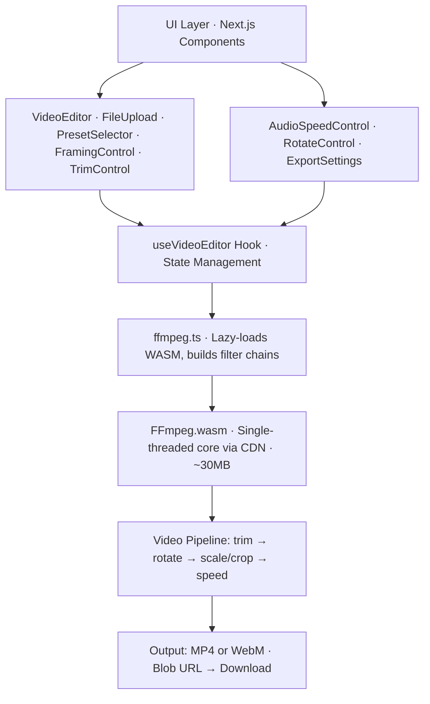

<div align="center">

# Reframe

### Free, open-source video editor that runs entirely in your browser.

### No login. No uploads. No ads. 100% private.

[](https://github.com/magic-peach/reframe/stargazers)

[](https://github.com/magic-peach/reframe/network/members)

[](https://github.com/magic-peach/reframe/issues)

[](https://nextjs.org)
[](https://www.typescriptlang.org)
[](https://ffmpegwasm.netlify.app)
[](LICENSE)
[](https://gssoc.girlscript.tech)

**[Try it now →](https://github.com/magic-peach/reframe)** · **[Report a Bug](https://github.com/magic-peach/reframe/issues/new?labels=bug)** · **[Request a Feature](https://github.com/magic-peach/reframe/issues/new?labels=feature)**

</div>

---

## What is Reframe?

Reframe is a **browser-based video editor** — everything happens on your device. Your videos are never sent to any server. No account needed. No fees. Just open and edit.

> Built for everyone — whether you're a creator resizing videos for social media, or just someone who wants to quickly trim and convert without installing bulky software.

## Features

- **Instant Resizing** — 11 preset formats (Reels, TikTok, YouTube, Instagram, etc.) + custom dimensions
- **Flexible Framing** — Fit (letterbox) or Fill (crop) to your target aspect ratio
- **Precise Trimming** — Cut start and end times with real-time duration validation
- **Rotation** — 0°, 90°, 180°, 270° rotation support
- **Audio Control** — Keep or mute audio independently
- **Speed Control** — 0.25x to 4x playback speed with smooth audio adjustment
- **Quality Settings** — CRF slider for quality vs. file size trade-offs
- **Smooth UX** — Lottie animations, live export progress, instant download

Everything stays on your device. No servers. No tracking. No login.

---

## Getting Started

### Prerequisites

- [Bun](https://bun.sh) (recommended) or Node.js 18+

### Installation

```bash
git clone https://github.com/magic-peach/reframe.git
cd reframe
bun install
```

### Development

```bash
bun run dev
```

Open [http://localhost:3000](http://localhost:3000) — changes reflect instantly with Next.js Fast Refresh.

### Production Build

```bash
bun run build
```

Outputs a static site to `out/` — deploy to Vercel, Netlify, GitHub Pages, or any static host.

---

## Deploying

Reframe is a fully static app. Deploy the `out/` folder anywhere:

| Platform             | Command                                                           |
| -------------------- | ----------------------------------------------------------------- |
| **Vercel**           | Connect your fork at [vercel.com/new](https://vercel.com/new)     |
| **Netlify**          | Connect your fork at [netlify.com](https://app.netlify.com/start) |
| **GitHub Pages**     | Push `out/` to `gh-pages` branch                                  |
| **Cloudflare Pages** | Connect your fork in the Cloudflare dashboard                     |

---

## How It Works

1. **Load Video** → User selects a file → App detects resolution and duration
2. **Build Recipe** → User adjusts presets, framing, trim, speed → Creates `EditRecipe`
3. **Export** → Click Export → FFmpeg WASM loads from CDN (~30 MB, cached after first use) → Filtergraph runs locally → File downloads
4. **Done** → Your edited video is ready. Nothing was uploaded anywhere.

### Architecture



### Key Files

| File                             | Purpose                                                  |
| -------------------------------- | -------------------------------------------------------- |
| `src/components/VideoEditor.tsx` | Root component; layout, state orchestration              |
| `src/hooks/useVideoEditor.ts`    | State management (file, recipe, export status)           |
| `src/lib/ffmpeg.ts`              | FFmpeg wrapper; lazy-loads WASM, builds filter chains    |
| `src/lib/presets.ts`             | 11 preset definitions (9:16, 16:9, 4:5, etc.)            |
| `src/lib/types.ts`               | TypeScript types for EditRecipe, ExportResult, etc.      |
| `src/components/*.tsx`           | Individual control panels (Trim, Rotate, Speed, Quality) |

---

## Tech Stack

| Layer                | Tech                                   |
| -------------------- | -------------------------------------- |
| **Framework**        | Next.js 15 (App Router, static export) |
| **Language**         | TypeScript 5                           |
| **Styling**          | Tailwind CSS v3                        |
| **Icons**            | Lucide React                           |
| **Animations**       | Lottie Web                             |
| **Video Processing** | FFmpeg.wasm (single-threaded)          |
| **Fonts**            | Bebas Neue · Syne · DM Sans            |

---

## Supported Browsers

| Browser       | Support    | Notes                   |
| ------------- | ---------- | ----------------------- |
| Chrome 90+    | ✅ Full    | Recommended             |
| Firefox 89+   | ✅ Full    |                         |
| Safari 15+    | ✅ Full    |                         |
| Edge 90+      | ✅ Full    |                         |
| Mobile Chrome | ✅ Full    |                         |
| Mobile Safari | ⚠️ Partial | Large files may be slow |

---

## Contributing

### ⭐ Star this repo — it helps more people find Reframe!

**Reframe is an open-source project and we welcome contributions of all kinds** — from fixing a typo in the README to implementing a brand new feature. Every contribution matters.

---

### 🌸 GirlScript Summer of Code 2026

Reframe is an **official project in GirlScript Summer of Code (GSSoC) 2026**! We have **300+ open issues** across all difficulty levels — from beginner-friendly tasks to advanced features.

> **If you're a GSSoC participant**, add the `gssoc'26` label to any issue you want to work on, and mention your GitHub username in a comment to claim it.

#### Find issues to work on:

| Level               | Label                                                                                                          | Description                                                                        |
| ------------------- | -------------------------------------------------------------------------------------------------------------- | ---------------------------------------------------------------------------------- |
| 🟢 **Beginner**     | [`good first issue`](https://github.com/magic-peach/reframe/issues?q=is%3Aopen+label%3A%22good+first+issue%22) | Small, well-defined tasks — perfect if this is your first open source contribution |
| 🟡 **Intermediate** | [`enhancement`](https://github.com/magic-peach/reframe/issues?q=is%3Aopen+label%3Aenhancement)                 | Feature improvements and UX enhancements                                           |
| 🔴 **Advanced**     | [`feature`](https://github.com/magic-peach/reframe/issues?q=is%3Aopen+label%3Afeature)                         | New features requiring deeper understanding of FFmpeg/WASM                         |
| 🔵 **Any Level**    | [`documentation`](https://github.com/magic-peach/reframe/issues?q=is%3Aopen+label%3Adocumentation)             | Docs, guides, and README improvements                                              |
| ♿ **Any Level**    | [`accessibility`](https://github.com/magic-peach/reframe/issues?q=is%3Aopen+label%3Aaccessibility)             | Making Reframe usable for everyone                                                 |

**[→ Browse all GSSoC'26 issues](https://github.com/magic-peach/reframe/issues?q=is%3Aopen+label%3A%22gssoc%2726%22)**

---

### How to Contribute

1. **Find an issue** — Browse [open issues](https://github.com/magic-peach/reframe/issues) or pick one from the table above
2. **Comment on the issue** — Say you'd like to work on it so we don't duplicate effort
3. **Fork the repo** — Click the Fork button at the top right
4. **Create a branch** — `git checkout -b feat/your-feature-name`
5. **Make your changes** — Code, test, and commit
6. **Open a Pull Request** — Reference the issue number in your PR description
7. **Get reviewed** — We'll review and merge your contribution!

See [CONTRIBUTING.md](CONTRIBUTING.md) for the full guide including development setup, code style, and PR checklist.

---

## Contributors

Thank you to everyone who has contributed to Reframe! 🎉

[](https://github.com/magic-peach/reframe/graphs/contributors)

---

## Privacy

Reframe processes all videos **100% client-side**. Your video files are never uploaded to any server. You can even use Reframe offline (after first load). The source code is fully open for inspection.

---

## License

MIT License — See [LICENSE](LICENSE) for details.

---

<div align="center">

**If Reframe saved you time, please [⭐ star the repo](https://github.com/magic-peach/reframe) — it helps others discover it!**

Made with ❤️ for everyone who just wants to edit a video without the hassle.

</div>
