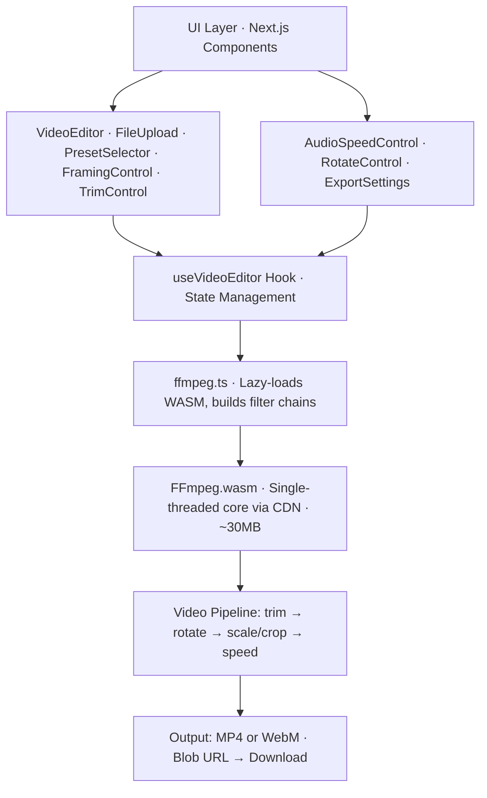

# Reframe Architecture

This document provides detailed technical information about Reframe's architecture, design choices, and implementation details.

---

## Table of Contents

- [How It Works](#how-it-works)
- [Architecture Diagram](#architecture-diagram)
- [Key Files](#key-files)
- [Tech Stack](#tech-stack)
- [Video Processing Pipeline](#video-processing-pipeline)
- [Design Choices](#design-choices)

---

## How It Works

1. **Load Video** → User selects a file → App detects resolution and duration
2. **Build Recipe** → User adjusts presets, framing, trim, speed → Creates `EditRecipe`
3. **Export** → Click Export → FFmpeg WASM loads from CDN (~30 MB, cached after first use) → Filtergraph runs locally → File downloads
4. **Done** → Your edited video is ready. Nothing was uploaded anywhere.

---

## Architecture Diagram

---

## Key Files

| File                             | Purpose                                                  |
| -------------------------------- | -------------------------------------------------------- |
| `src/components/VideoEditor.tsx` | Root component; layout, state orchestration              |
| `src/hooks/useVideoEditor.ts`    | State management (file, recipe, export status)           |
| `src/lib/ffmpeg.ts`              | FFmpeg wrapper; lazy-loads WASM, builds filter chains    |
| `src/lib/presets.ts`             | 11 preset definitions (9:16, 16:9, 4:5, etc.)            |
| `src/lib/types.ts`               | TypeScript types for EditRecipe, ExportResult, etc.      |
| `src/components/*.tsx`           | Individual control panels (Trim, Rotate, Speed, Quality) |

---

## Tech Stack

| Layer                | Tech                                   |
| -------------------- | -------------------------------------- |
| **Framework**        | Next.js 15 (App Router, static export) |
| **Language**         | TypeScript 5                           |
| **Styling**          | Tailwind CSS v3                        |
| **Icons**            | Lucide React                           |
| **Animations**       | Lottie Web                             |
| **Video Processing** | FFmpeg.wasm (single-threaded)          |
| **Fonts**            | Bebas Neue · Syne · DM Sans            |

---

## Video Processing Pipeline

Reframe uses FFmpeg.wasm to process videos entirely in the browser. The processing pipeline follows these steps:

1. **Video Input** — User-selected video file is loaded into memory
2. **Trim** — If trim times are specified, the video is trimmed using FFmpeg's `trim` filter
3. **Rotate** — Video is rotated using FFmpeg's `transpose` filter (0°, 90°, 180°, 270°)
4. **Scale/Crop** — Video is resized based on the selected preset and framing mode:
   - **Fit mode**: Video is scaled to fit within the target dimensions with letterboxing/pillarboxing
   - **Fill mode**: Video is scaled to fill the target dimensions and cropped
5. **Speed Adjustment** — Playback speed is adjusted using `setpts` (video) and `atempo` (audio) filters
6. **Audio Processing** — Audio is either kept (with speed adjustment) or removed based on user preference
7. **Encoding** — Final video is encoded to MP4 (H.264) or WebM (VP9) format
8. **Download** — Processed video is made available as a Blob URL for download

---

## Design Choices

### Why FFmpeg.wasm?

- **Client-side processing** — No server infrastructure needed, complete privacy
- **Industry-standard** — FFmpeg is the gold standard for video processing
- **Feature-rich** — Supports all common video operations (trim, rotate, scale, speed, etc.)
- **Browser compatibility** — Works in all modern browsers via WebAssembly

### Why Next.js Static Export?

- **Zero backend** — Entire app is static HTML/CSS/JS
- **Fast deployment** — Can be hosted on any static file server
- **Offline-capable** — Works offline after initial load (with service worker)
- **SEO-friendly** — Static pages are easily crawlable

### Why Single-threaded FFmpeg?

- **Broader compatibility** — Multi-threaded WASM requires SharedArrayBuffer, which has strict CORS requirements
- **Simpler deployment** — No need for special HTTP headers (COOP/COEP)
- **Good enough performance** — For typical video editing tasks, single-threaded performance is acceptable

### State Management

Reframe uses a custom React hook (`useVideoEditor`) for state management instead of external libraries like Redux or Zustand:

- **Simplicity** — No additional dependencies
- **Type safety** — Full TypeScript support
- **Sufficient for scope** — App state is relatively simple and doesn't require complex state management

### Component Architecture

Components are organized by feature:

- **Atomic components** — Small, reusable components (LottiePlayer, buttons)
- **Feature components** — Components for specific features (TrimControl, RotateControl)
- **Layout components** — High-level layout and orchestration (VideoEditor)

This structure makes it easy to:
- Find and modify specific features
- Add new features without affecting existing code
- Test components in isolation

---

## Browser Support

| Browser       | Support    | Notes                   |
| ------------- | ---------- | ----------------------- |
| Chrome 90+    | ✅ Full    | Recommended             |
| Firefox 89+   | ✅ Full    |                         |
| Safari 15+    | ✅ Full    |                         |
| Edge 90+      | ✅ Full    |                         |
| Mobile Chrome | ✅ Full    |                         |
| Mobile Safari | ⚠️ Partial | Large files may be slow |

### Browser Requirements

- **WebAssembly support** — Required for FFmpeg.wasm
- **File API** — For reading user-selected video files
- **Blob URLs** — For downloading processed videos
- **Modern JavaScript** — ES2017+ features

---

## Performance Considerations

### Memory Usage

- Video files are loaded entirely into memory
- FFmpeg.wasm requires additional memory for processing
- Large videos (>500 MB) may cause performance issues on low-memory devices

### Processing Speed

Processing speed depends on:
- Video resolution and duration
- Selected quality settings (CRF value)
- Device CPU performance
- Browser implementation

Typical processing times:
- 1080p, 30s video: ~30-60 seconds
- 4K, 30s video: ~2-5 minutes

### Optimization Strategies

- **Lazy loading** — FFmpeg.wasm is only loaded when user clicks Export
- **CDN caching** — FFmpeg core files are cached by the browser after first load
- **Efficient filters** — Filter chains are optimized to minimize processing steps
- **Quality presets** — CRF slider allows users to balance quality vs. processing time

---

## Future Architecture Improvements

Potential improvements for future versions:

1. **Multi-threaded FFmpeg** — Faster processing with SharedArrayBuffer (requires COOP/COEP headers)
2. **Web Workers** — Offload processing to background thread to keep UI responsive
3. **Streaming processing** — Process video in chunks to reduce memory usage
4. **GPU acceleration** — Use WebGPU for faster video processing (when browser support improves)
5. **Service Worker** — Enable full offline functionality with caching
6. **IndexedDB storage** — Store processed videos locally for later download

---

## Contributing to Architecture

When contributing architecture changes:

1. **Maintain privacy** — All processing must remain client-side
2. **Keep it simple** — Avoid over-engineering; prefer simple solutions
3. **Document decisions** — Update this file when making architectural changes
4. **Consider performance** — Test with large videos on low-end devices
5. **Ensure compatibility** — Test in all supported browsers

See [CONTRIBUTING.md](../CONTRIBUTING.md) for general contribution guidelines.
